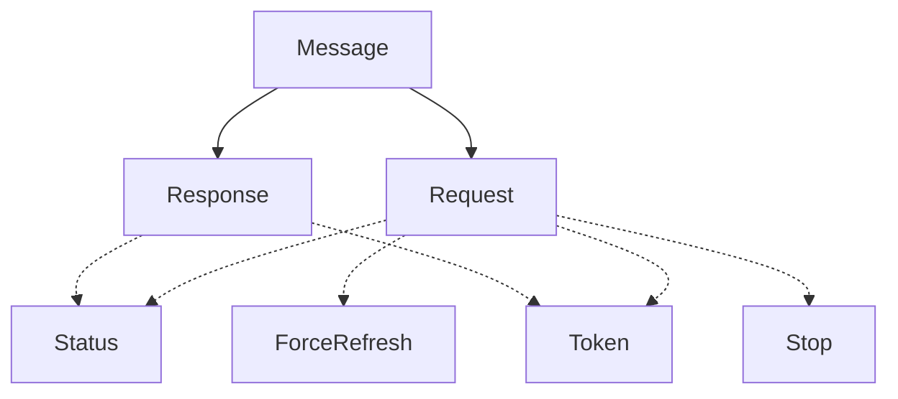
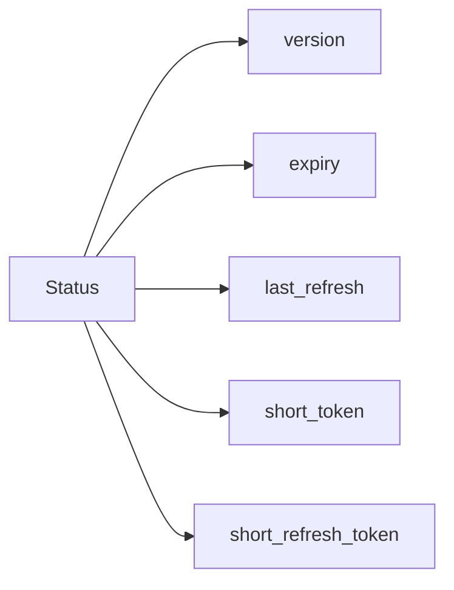
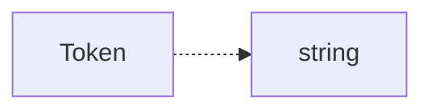

# Core library
This library contains the definition for messages.

## Message structure
A "message" is a simple `enum` that can be one of two variants:
- `Request`
    - Client requested an operation or resource.
- `Response`
    - Contains the resource requested by the client.

Requests and responses contain deeper level variants.



### Get status message (`Status`)
The `Status` request message is used to get the currect status of the daemon.

Response message structure:


Response JSON example:
```json
{
    "Response": {
        "Status": {
            "version": "1.0",
            "expiry": {
                "secs": 420,
                "nanos": 0
            },
            "last_refresh": {
                "secs": 69,
                "nanos": 0
            },
            "short_token": "abcdefghijklmnopqrstuvxyz",
            "short_refresh_token": "abcdefghijklmnopqrstuvxyz"
        }
    }
}
```

### Get currect token message (`Token`)
The `Token` request message is used to get the currect OAuth token.

Response message structure:


Response JSON example:
```json
{
    "Response": {
        "Token": "abcdefghijklmnopqrstuvxyz"
    }
}
```

### Get currect token message (`ForceRefresh`)
The `ForceRefresh` request message is used to forcibly request the next token even if the current one is still valid.

This request does **not** have a response.

### Get currect token message (`Stop`)
The `Stop` request message is used to stop the daemon.

This request does **not** have a response.